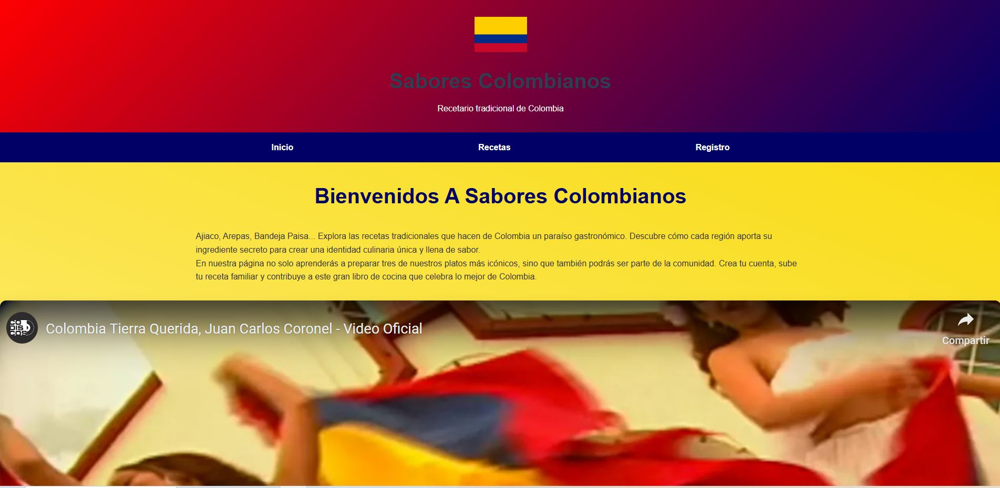
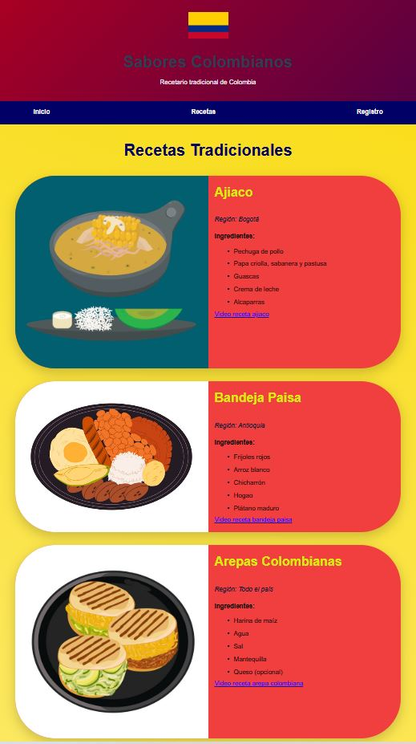
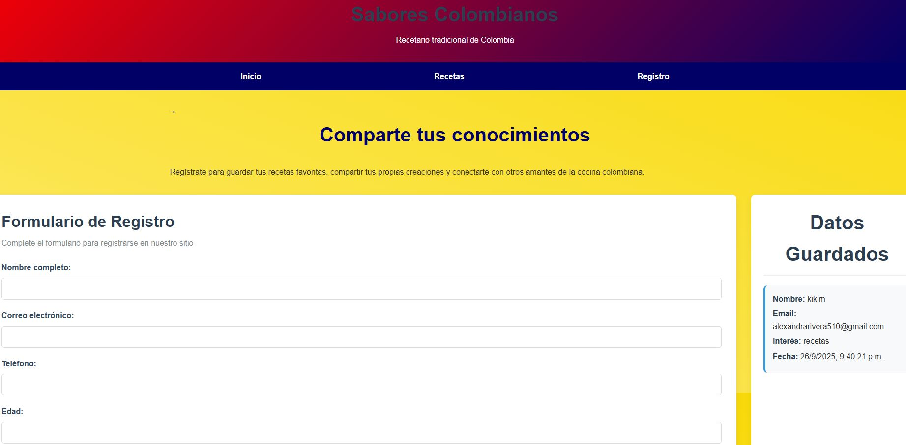

# 💛💙❤️ **RECETARIO COLOMBIANO**

Esta plataforma web esta diseñada para que los amantes de la cocina pueden explorar, aprender y compartir recetas auténticas de todas las regiones del país de Colombia

## 🔎 ¿Qué se puede hacer en la app?

__Descubrir recetas tradicionales:__ Se podran encuentrar platos típicos de cada rincón de Colombia, con ingredientes y pasos detallados.

__Aprender a cocinar:__ Tutoriales fáciles de seguir, desde el sancocho hasta los buñuelos.

__Unirte a la comunidad:__ Regístrate para guardar tus recetas favoritas, comentar y compartir tus propias creaciones culinarias.

## ✍️ Como funciona

La aplicación está organizada en tres secciones principales, cada una accesible desde el menú: inicio, recetario y formulario.

__Inicio:__ Realiza una bienvenida a la aplicación, da una descripción sobre Colombia y sus recetas, acompañada de un video musical colombiano que resalta la riqueza cultural y las bellezas de nuestra región.

__Recetario:__ Ofrece tres recetas tradicionales colombianas, con el listado detallado de ingredientes y un video explicativo que guía paso a paso en la preparación de cada plato.

__Formulario:__ Contiene un espacio de registro que permite a los usuarios inscribirse para seguir recibiendo nuevos recetarios o, si lo desean, compartir sus propios conocimientos gastronómicos.

